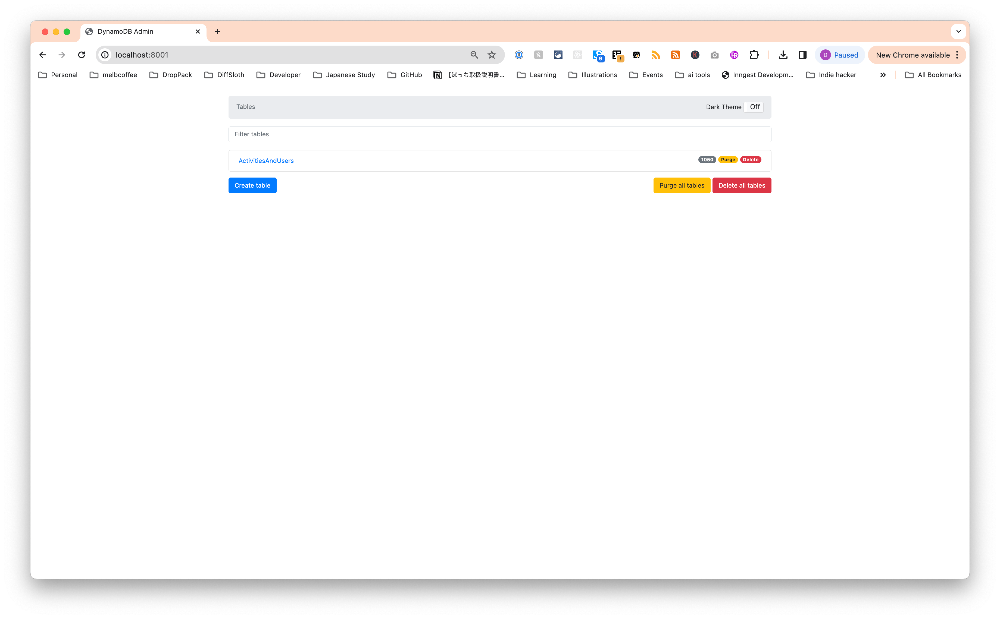

# Spike DynamoDB for self-controlled batch fetch

## How to run the spike

I opted to use [LocalStack](https://www.localstack.cloud/) for the spike with `aws-cdk` to attempt to keep it minimal. This means that you will need to run.

### Prerequisites

- Docker (used for `docker compose`).
- Node 20.
- PNPM

## Running the spike

Run a bash bootstrap script to set up LocalStack, DynamoDB admin, deploy the AWS CDK locally (very limited capabilities but useful) and seed the data.

```bash
# Run the bootstrap script
$ pnpm bootstrap
```

Once the data it bootstrapped and Docker compose is up, you can head to `localhost:8001` to see the data.



Open the `spike-dynamodb-toolbox` table to see the date.

Otherwise, to run the spike:

```bash
pnpm start
```

The results will log to the console. For example:

```bash
@ Party keys: [
  'PartyType#Merchant#PartyId#42af5853-7945-4ee8-8eef-a85759be27ec',
  'PartyType#Merchant#PartyId#33e13a9f-0852-4474-a220-67fa17f53c1b'
]
Running batch nunber: 1
@ Sorted roles (last 5): [
  {
    gsi_pk_2: 'PartyType#Merchant#PartyId#33e13a9f-0852-4474-a220-67fa17f53c1b',
    composite_id: 'ROLE#c86ece68-77cf-4282-b70f-fa472213c127',
    updated_at: '2024-03-01T01:54:21.760Z',
    name: 'x4fZmn7zlg',
    description: 'DWIYI0ab7U',
    created_at: '2024-03-01T01:54:21.760Z',
    sort_key: 'PartyType#Merchant#PartyId#33e13a9f-0852-4474-a220-67fa17f53c1b',
    gsi_sk_2: '2024-03-01T01:54:21.760Z'
  },
  {
    gsi_pk_2: 'PartyType#Merchant#PartyId#33e13a9f-0852-4474-a220-67fa17f53c1b',
    composite_id: 'ROLE#c921a6d7-3f69-4d43-a048-144b7035e281',
    updated_at: '2024-03-01T01:54:21.760Z',
    name: 'RswE6kIRBf',
    description: 'UYZs76cCGx',
    created_at: '2024-03-01T01:54:21.760Z',
    sort_key: 'PartyType#Merchant#PartyId#33e13a9f-0852-4474-a220-67fa17f53c1b',
    gsi_sk_2: '2024-03-01T01:54:21.760Z'
  },
  {
    gsi_pk_2: 'PartyType#Merchant#PartyId#33e13a9f-0852-4474-a220-67fa17f53c1b',
    composite_id: 'ROLE#8d9e52bd-b317-44b3-b1db-3e1d018e1859',
    updated_at: '2024-03-01T01:54:21.760Z',
    name: 'YUjx3WHEvl',
    description: 'PsQIICgZEa',
    created_at: '2024-03-01T01:54:21.760Z',
    sort_key: 'PartyType#Merchant#PartyId#33e13a9f-0852-4474-a220-67fa17f53c1b',
    gsi_sk_2: '2024-03-01T01:54:21.760Z'
  },
  {
    gsi_pk_2: 'PartyType#Merchant#PartyId#33e13a9f-0852-4474-a220-67fa17f53c1b',
    composite_id: 'ROLE#d1389081-0757-46b4-8541-1fd6a6a98cb8',
    updated_at: '2024-03-01T01:54:21.760Z',
    name: 'xXrpDQfc62',
    description: 'GLuVFnivIp',
    created_at: '2024-03-01T01:54:21.760Z',
    sort_key: 'PartyType#Merchant#PartyId#33e13a9f-0852-4474-a220-67fa17f53c1b',
    gsi_sk_2: '2024-03-01T01:54:21.760Z'
  },
  {
    gsi_pk_2: 'PartyType#Merchant#PartyId#33e13a9f-0852-4474-a220-67fa17f53c1b',
    composite_id: 'ROLE#22d68dd9-e6b8-4440-b462-21cac37ec36d',
    updated_at: '2024-03-01T01:54:21.760Z',
    name: 'Pf8mc5kpQZ',
    description: 'ByoVlI6VUI',
    created_at: '2024-03-01T01:54:21.760Z',
    sort_key: 'PartyType#Merchant#PartyId#33e13a9f-0852-4474-a220-67fa17f53c1b',
    gsi_sk_2: '2024-03-01T01:54:21.760Z'
  }
]
@ Paginated roles: [
  {
    gsi_pk_2: 'PartyType#Merchant#PartyId#42af5853-7945-4ee8-8eef-a85759be27ec',
    composite_id: 'ROLE#42e133db-ae72-4189-884b-25f1bd98166a',
    updated_at: '2024-03-01T01:54:21.617Z',
    name: 'LWc5HLU7A0',
    description: 'cAPxpUMMG9',
    created_at: '2024-03-01T01:54:21.617Z',
    sort_key: 'PartyType#Merchant#PartyId#42af5853-7945-4ee8-8eef-a85759be27ec',
    gsi_sk_2: '2024-03-01T01:54:21.617Z'
  },
  {
    gsi_pk_2: 'PartyType#Merchant#PartyId#42af5853-7945-4ee8-8eef-a85759be27ec',
    composite_id: 'ROLE#bdc00805-29da-40f3-a8fe-a973a26c7e66',
    updated_at: '2024-03-01T01:54:21.618Z',
    name: 'LvwXjVConv',
    description: 'O6YqwYZkeG',
    created_at: '2024-03-01T01:54:21.618Z',
    sort_key: 'PartyType#Merchant#PartyId#42af5853-7945-4ee8-8eef-a85759be27ec',
    gsi_sk_2: '2024-03-01T01:54:21.618Z'
  },
  {
    gsi_pk_2: 'PartyType#Merchant#PartyId#42af5853-7945-4ee8-8eef-a85759be27ec',
    composite_id: 'ROLE#d2bbf6fe-ec36-4e27-9014-7618628250fc',
    updated_at: '2024-03-01T01:54:21.619Z',
    name: 'o7eoOcR1uf',
    description: 'Z2nHcQLfoA',
    created_at: '2024-03-01T01:54:21.619Z',
    sort_key: 'PartyType#Merchant#PartyId#42af5853-7945-4ee8-8eef-a85759be27ec',
    gsi_sk_2: '2024-03-01T01:54:21.619Z'
  },
  {
    gsi_pk_2: 'PartyType#Merchant#PartyId#42af5853-7945-4ee8-8eef-a85759be27ec',
    composite_id: 'ROLE#eb5e8735-4874-40a2-9400-200bf0c694c9',
    updated_at: '2024-03-01T01:54:21.619Z',
    name: 'krcV5X2tDW',
    description: 'n4PlRRpBIp',
    created_at: '2024-03-01T01:54:21.619Z',
    sort_key: 'PartyType#Merchant#PartyId#42af5853-7945-4ee8-8eef-a85759be27ec',
    gsi_sk_2: '2024-03-01T01:54:21.619Z'
  },
  {
    gsi_pk_2: 'PartyType#Merchant#PartyId#42af5853-7945-4ee8-8eef-a85759be27ec',
    composite_id: 'ROLE#70bf8bee-4579-455b-a2e4-102709e153be',
    updated_at: '2024-03-01T01:54:21.619Z',
    name: 'ZbPep2Ylyf',
    description: 'MUGCS41ZFZ',
    created_at: '2024-03-01T01:54:21.619Z',
    sort_key: 'PartyType#Merchant#PartyId#42af5853-7945-4ee8-8eef-a85759be27ec',
    gsi_sk_2: '2024-03-01T01:54:21.619Z'
  }
]
@ sorted roles length 20
@ paginated roles length 10
```
